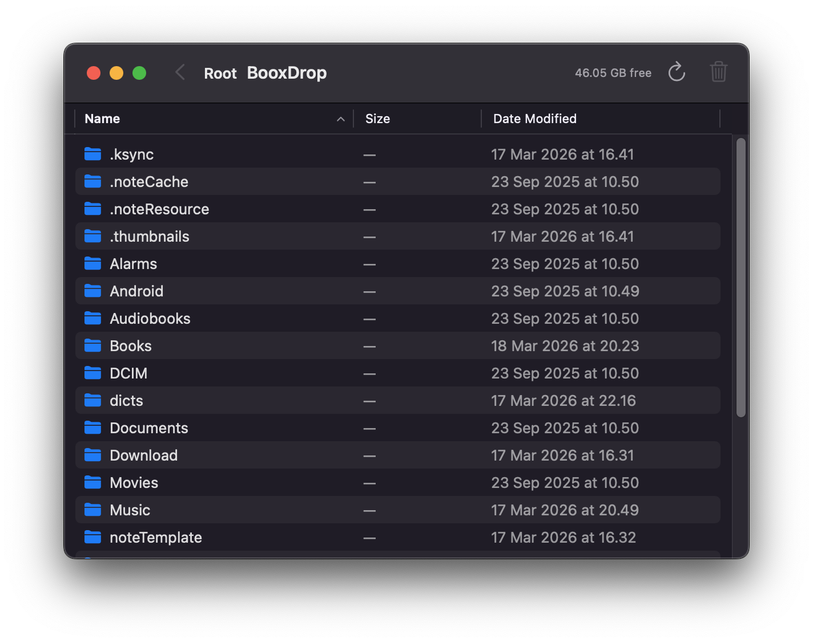

# BooxDrop

Native macOS MTP file manager for Boox e-readers and Android devices.

Two tools in one project:
- **BooxDrop.app** — SwiftUI Finder-like GUI
- **booxcp** — CLI for scripted file transfers



## Features

- Single-pane Finder-style file browser
- Drag & drop files from Finder to device
- Delete files and folders
- Folder navigation with breadcrumbs
- Storage info (free/total space)
- Auto-detects device connection

### CLI (`booxcp`)

```
booxcp ls /Books              # List files
booxcp cp book.epub /Books/   # Copy file to device
booxcp cp ./MyBooks/ /Books/  # Copy entire folder
booxcp get /Books/b.epub ./   # Download from device
booxcp rm /Books/old.epub     # Delete file
booxcp mkdir /Books/NewSeries # Create folder
booxcp tree /Books 2          # Directory tree
booxcp df                     # Storage info
```

## Install

```bash
# dependency
brew install libmtp

# build both targets
xcodegen generate
xcodebuild -scheme BooxDrop -configuration Release build
xcodebuild -scheme booxcp -configuration Release build

# install CLI to PATH
cp $(find ~/Library/Developer/Xcode/DerivedData/BooxDrop-*/Build/Products/Release -name booxcp -type f) /opt/homebrew/bin/
```

## Requirements

- macOS 14+
- `libmtp` (via Homebrew)
- Xcode 15+
- Device must be in MTP/File Transfer mode

## License

MIT
